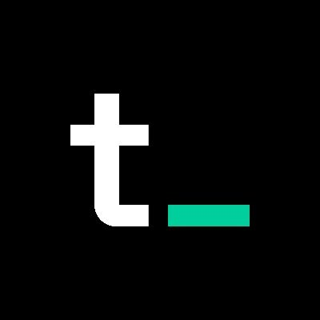

  <a href="https://tokenterminal.com/?utm_source=github-index-repo">
    
    <h2 align="center">Token Terminal</h2>
  </a>
  <a href="https://index.tokenterminal.com/?utm_source=github-index-repo">
    <h3 align="center">Token Terminal Index (TTI) - Backtesting</h3>
  </a>

The [Token Terminal Index](https://index.tokenterminal.com/?utm_source=github-index-repo) (TTI) uses a fundamentals-based ruleset for its index construction. Assets included in the TTI are chosen primarily based on their price to sales (P/S) ratio. The TTI is powered and managed by the Index Coop.

This index tracks the performance of revenue-generating, fairly valued crypto protocols.

Here, we provide the source code for the backtesting library used to simulate the theoretical historical performance and composition of TTI as proposed [here](https://gov.indexcoop.com/t/iip-103-launch-token-terminal-smart-beta-index-new/3031) and showcased on the official [TTI proposal website](https://index.tokenterminal.com/?utm_source=github-index-repo):

- Backtesting library ➡️ [/backtesting](./backtesting)
- TTI proposal website ➡️ [/frontend](./frontend)

The results of this backtest are illustrative only and primarily aim to demonstrate the theoretical performance and composition of the TTI over a relatively short period, which includes periods of up/down trends and significant volatility in the crypto markets. The TTI backtesting was performed assuming the following: instantaneous rebalances on the first day of each month, no slippage, no trading or streaming fees — which we acknowledge do positively bias the TTI’s theoretical performance compared to the benchmarks. This methodology is subject to change upon further research and implementation to reflect live market conditions (e.g. liquidity, trading execution factors).
